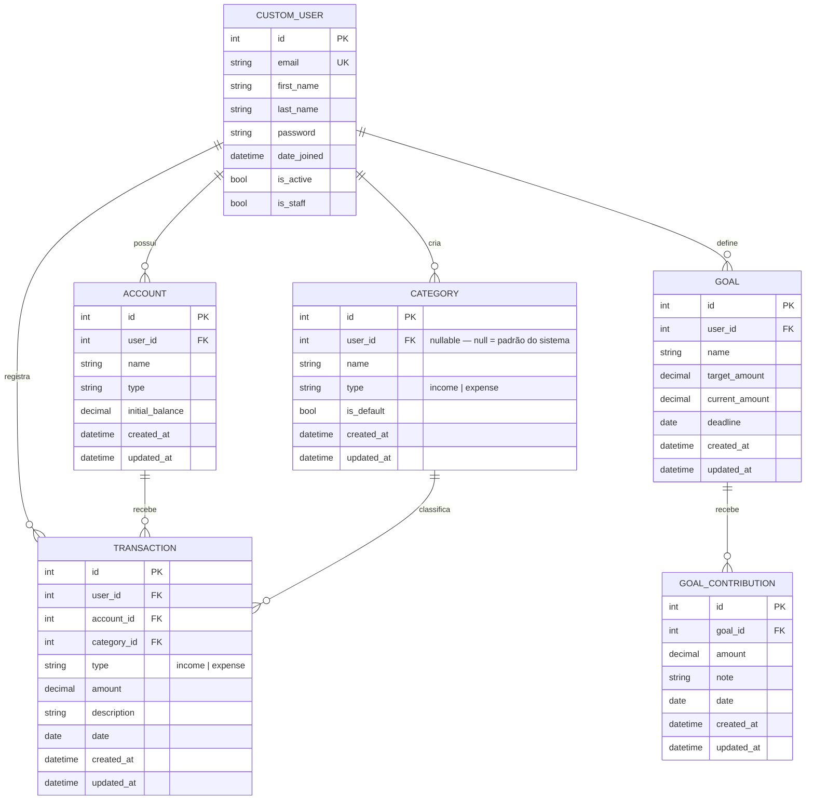
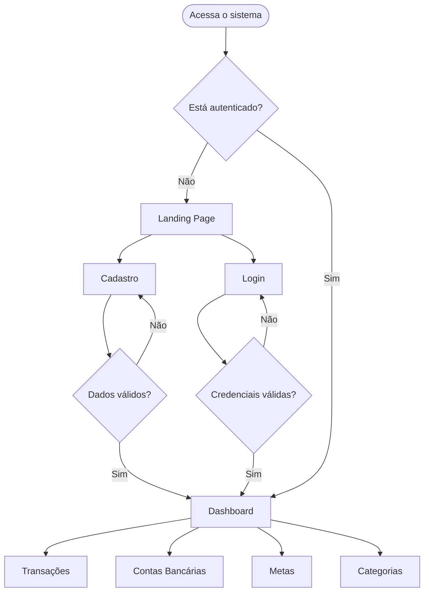

# Arquitetura

## Estrutura de diretórios

```
finanpy/
├── manage.py
├── pyproject.toml
├── uv.lock
│
├── kernel/                     # Configurações Django (projeto)
│   ├── settings.py
│   ├── urls.py
│   ├── wsgi.py
│   └── asgi.py
│
├── core/                       # Landing page pública
├── users/                      # CustomUser — autenticação por e-mail
├── accounts/                   # Contas bancárias
├── categories/                 # Categorias de transações
├── transactions/               # Receitas e despesas
├── goals/                      # Metas financeiras
├── dashboard/                  # Dashboard principal
│
└── templates/                  # Templates globais compartilhados
    ├── base.html
    └── partials/
        ├── navbar.html
        ├── sidebar.html
        └── messages.html
```

Cada app segue a estrutura padrão Django acrescida de `forms.py`, `urls.py` e o diretório `templates/<app>/`.

Apps que utilizam signals mantêm a lógica em `signals.py` dentro da própria app.

## Apps

| App | Responsabilidade |
|---|---|
| `kernel` | Configurações globais do projeto Django |
| `core` | Landing page pública |
| `users` | Modelo `CustomUser`, cadastro, login e logout |
| `accounts` | CRUD de contas bancárias |
| `categories` | Categorias padrão e personalizadas |
| `transactions` | Registro e listagem de receitas e despesas |
| `goals` | Metas financeiras e aportes |
| `dashboard` | Visão consolidada das finanças |

## Modelo de dados



## Fluxo de navegação


