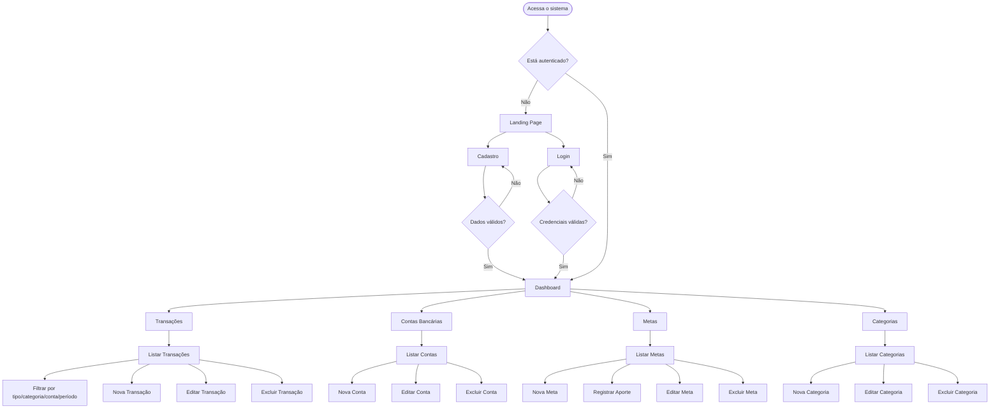
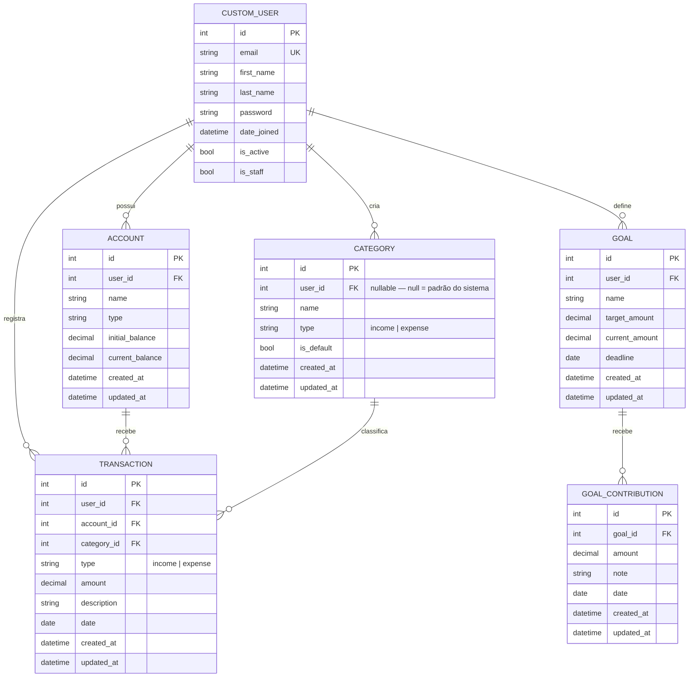

# Product Requirement Document (PRD) — Finanpy

---

## 1. Visão Geral

O **Finanpy** é um sistema web de gestão de finanças pessoais desenvolvido com Python e Django. Sua missão é oferecer ao usuário uma experiência simples, moderna e eficiente para controlar receitas, despesas, contas bancárias e metas financeiras — tudo em um único lugar, com interface intuitiva e design agradável.

O sistema é construído com foco em **simplicidade técnica e visual**: sem over engineering, sem tecnologias desnecessárias. A stack é Django full stack com Django Template Language e TailwindCSS no frontend, autenticação nativa do Django com login via e-mail, e SQLite como banco de dados padrão.

---

## 2. Sobre o Produto

| Campo | Detalhe |
|---|---|
| **Nome** | Finanpy |
| **Tipo** | Aplicação web — sistema de gestão de finanças pessoais |
| **Stack principal** | Python 3.12+, Django 6.x, Django Template Language, TailwindCSS |
| **Banco de dados** | SQLite (padrão Django) |
| **Autenticação** | Sistema nativo Django, login por e-mail |
| **Idioma da interface** | Português Brasileiro |
| **Idioma do código** | Inglês |

O sistema possui uma **landing page pública** com opções de cadastro e login. Após autenticado, o usuário acessa o **dashboard principal** com visão consolidada das suas finanças.

---

## 3. Propósito

Permitir que qualquer pessoa possa registrar, acompanhar e entender sua situação financeira pessoal de forma simples, visual e organizada, sem a complexidade de ferramentas voltadas para empresas ou profissionais de finanças.

**Problemas que o Finanpy resolve:**

- Falta de controle sobre gastos mensais
- Dificuldade em visualizar o saldo real disponível por conta
- Ausência de histórico de receitas e despesas organizado por categoria
- Dificuldade em criar e acompanhar metas financeiras

---

## 4. Público-Alvo

- **Perfil principal:** Pessoas físicas entre 18 e 45 anos que desejam organizar suas finanças pessoais
- **Nível técnico:** Usuário comum, sem necessidade de conhecimento financeiro avançado
- **Contexto de uso:** Uso individual, em dispositivos desktop e mobile
- **Dores do usuário:**
  - Não sabe exatamente quanto gasta por mês
  - Usa planilhas dispersas ou anotações informais
  - Quer uma solução gratuita, simples e fácil de usar
  - Quer visualizar seu progresso financeiro de forma clara

---

## 5. Objetivos

### 5.1 Objetivos do Produto

1. Fornecer registro de receitas e despesas classificadas por categoria
2. Gerenciar múltiplas contas bancárias pessoais
3. Exibir dashboard com resumo financeiro consolidado do mês
4. Permitir o controle e acompanhamento de metas financeiras
5. Oferecer histórico de transações com filtros por período, categoria e conta
6. Ser responsivo e utilizável em qualquer dispositivo

### 5.2 Objetivos de Negócio

1. Entregar um MVP funcional com baixo custo de infraestrutura (SQLite + Django puro)
2. Manter código limpo, simples e fácil de evoluir
3. Validar o produto com usuários reais antes de adicionar complexidade

---

## 6. Requisitos Funcionais

### 6.1 Autenticação e Usuários

- **RF01** — O sistema deve permitir cadastro de novos usuários com nome, e-mail e senha
- **RF02** — O login deve ser feito com e-mail (não username)
- **RF03** — O sistema deve permitir logout
- **RF04** — O sistema deve redirecionar usuários não autenticados para a página de login
- **RF05** — Após login, o usuário é redirecionado ao dashboard principal
- **RF06** — O sistema deve usar um modelo de usuário customizado (`CustomUser`) que herda de `AbstractUser`, substituindo `username` por `email` como identificador único

### 6.2 Landing Page (Pública)

- **RF07** — O sistema deve ter uma página inicial pública com apresentação do produto
- **RF08** — A landing page deve conter botões de "Cadastre-se" e "Entrar"
- **RF09** — Usuário já autenticado, ao acessar a landing page, deve ser redirecionado ao dashboard

### 6.3 Dashboard

- **RF10** — O dashboard deve exibir o saldo total consolidado (soma de todas as contas)
- **RF11** — O dashboard deve exibir total de receitas do mês corrente
- **RF12** — O dashboard deve exibir total de despesas do mês corrente
- **RF13** — O dashboard deve exibir as últimas 5 transações registradas
- **RF14** — O dashboard deve exibir as metas financeiras ativas com progresso

### 6.4 Contas Bancárias

- **RF15** — O usuário deve poder criar contas bancárias informando: nome, tipo (corrente, poupança, carteira) e saldo inicial
- **RF16** — O usuário deve poder editar uma conta bancária
- **RF17** — O usuário deve poder excluir uma conta bancária (apenas se não houver transações vinculadas)
- **RF18** — O usuário deve poder listar todas as suas contas com saldo atual

### 6.5 Categorias

- **RF19** — O sistema deve ter categorias padrão pré-cadastradas (ex: Alimentação, Transporte, Saúde, Lazer, Salário, Educação, Moradia, Outros)
- **RF20** — O usuário deve poder criar categorias personalizadas com nome e tipo (receita/despesa)
- **RF21** — O usuário deve poder editar e excluir suas categorias personalizadas
- **RF22** — Categorias padrão do sistema não podem ser editadas nem excluídas pelo usuário

### 6.6 Transações

- **RF23** — O usuário deve poder registrar uma transação informando: tipo (receita/despesa), valor, categoria, conta bancária, descrição e data
- **RF24** — O usuário deve poder editar uma transação existente
- **RF25** — O usuário deve poder excluir uma transação
- **RF26** — O usuário deve poder listar todas as transações com filtros por tipo, categoria, conta e período (mês/ano)
- **RF27** — A listagem de transações deve exibir o total de receitas e despesas filtradas

### 6.7 Metas Financeiras

- **RF28** — O usuário deve poder criar metas financeiras com nome, valor alvo e prazo
- **RF29** — O usuário deve poder registrar aportes parciais em uma meta
- **RF30** — O sistema deve exibir o progresso de cada meta (valor atual vs. valor alvo em %)
- **RF31** — O usuário deve poder editar e excluir metas financeiras

---

### 6.8 Fluxograma UX (Mermaid)



---

## 7. Requisitos Não-Funcionais

- **RNF01** — O sistema deve ser responsivo e funcionar em dispositivos mobile e desktop
- **RNF02** — O código deve seguir a PEP8 e usar aspas simples
- **RNF03** — O código deve ser escrito em inglês
- **RNF04** — A interface do usuário deve estar em português brasileiro
- **RNF05** — Toda tabela/model deve conter os campos `created_at` e `updated_at`
- **RNF06** — O banco de dados utilizado deve ser SQLite (padrão Django)
- **RNF07** — O projeto deve usar Class Based Views sempre que possível
- **RNF08** — Signals, quando utilizados, devem ficar em `signals.py` dentro da app correspondente
- **RNF09** — Docker não será implementado no MVP (sprints finais)
- **RNF10** — Testes automatizados não serão implementados no MVP (sprints finais)
- **RNF11** — O projeto deve ser simples e enxuto — nada além do solicitado deve ser adicionado
- **RNF12** — O gerenciador de pacotes e ambientes deve ser o `uv`; é proibido uso direto de `pip` ou `requirements.txt`
- **RNF13** — As dependências do projeto ficam em `pyproject.toml` + `uv.lock`

---

## 8. Arquitetura Técnica

### 8.1 Stack

| Camada | Tecnologia |
|---|---|
| Linguagem | Python 3.12+ |
| Framework web | Django 6.x |
| Frontend | Django Template Language + TailwindCSS (CDN) |
| Banco de dados | SQLite (padrão Django) |
| Autenticação | Django Auth com `CustomUser` (login via e-mail) |
| Gerenciador de pacotes e ambientes | `uv` |
| Arquivo de dependências | `pyproject.toml` + `uv.lock` |

### 8.2 Comandos `uv` de Referência

| Ação | Comando |
|---|---|
| Adicionar dependência | `uv add <pacote>` |
| Adicionar dependência de dev | `uv add --dev <pacote>` |
| Sincronizar ambiente | `uv sync` |
| Executar servidor de desenvolvimento | `uv run manage.py runserver` |
| Criar migrations | `uv run manage.py makemigrations` |
| Aplicar migrations | `uv run manage.py migrate` |
| Criar superusuário | `uv run manage.py createsuperuser` |
| Carregar fixtures | `uv run manage.py loaddata <fixture>` |
| Criar app Django | `uv run manage.py startapp <nome>` |

### 8.3 Estrutura de Diretórios

```
finanpy/
├── manage.py
├── pyproject.toml
├── uv.lock
├── db.sqlite3
│
├── kernel/                         # Configurações Django (projeto)
│   ├── __init__.py
│   ├── settings.py
│   ├── urls.py
│   ├── wsgi.py
│   └── asgi.py
│
├── core/                           # App pública — landing page
│   ├── __init__.py
│   ├── apps.py
│   ├── views.py
│   ├── urls.py
│   └── templates/
│       └── core/
│           └── landing.html
│
├── users/                          # App de usuários — CustomUser (login via email)
│   ├── __init__.py
│   ├── admin.py
│   ├── apps.py
│   ├── backends.py                 # Backend de autenticação por e-mail
│   ├── forms.py                    # RegisterForm, LoginForm
│   ├── models.py                   # CustomUser
│   ├── views.py                    # RegisterView, LoginView, LogoutView
│   ├── urls.py
│   ├── migrations/
│   └── templates/
│       └── users/
│           ├── login.html
│           └── register.html
│
├── accounts/                       # App de contas bancárias
│   ├── __init__.py
│   ├── admin.py
│   ├── apps.py
│   ├── forms.py
│   ├── models.py                   # Account
│   ├── views.py
│   ├── urls.py
│   ├── migrations/
│   └── templates/
│       └── accounts/
│           ├── list.html
│           └── form.html
│
├── categories/                     # App de categorias de transações
│   ├── __init__.py
│   ├── admin.py
│   ├── apps.py
│   ├── forms.py
│   ├── models.py                   # Category
│   ├── views.py
│   ├── urls.py
│   ├── migrations/
│   └── templates/
│       └── categories/
│           ├── list.html
│           └── form.html
│
├── transactions/                   # App de transações (receitas e despesas)
│   ├── __init__.py
│   ├── admin.py
│   ├── apps.py
│   ├── forms.py
│   ├── models.py                   # Transaction
│   ├── views.py
│   ├── urls.py
│   ├── migrations/
│   └── templates/
│       └── transactions/
│           ├── list.html
│           └── form.html
│
├── goals/                          # App de metas financeiras
│   ├── __init__.py
│   ├── admin.py
│   ├── apps.py
│   ├── forms.py
│   ├── models.py                   # Goal, GoalContribution
│   ├── views.py
│   ├── urls.py
│   ├── migrations/
│   └── templates/
│       └── goals/
│           ├── list.html
│           └── form.html
│
├── dashboard/                      # App de dashboard principal
│   ├── __init__.py
│   ├── apps.py
│   ├── views.py
│   ├── urls.py
│   └── templates/
│       └── dashboard/
│           └── index.html
│
└── templates/                      # Templates globais compartilhados
    ├── base.html
    └── partials/
        ├── navbar.html
        ├── sidebar.html
        └── messages.html
```

### 8.4 Estrutura de Dados (Mermaid)



---

## 9. Design System

> Tudo implementado com TailwindCSS (via CDN) dentro do Django Template Language. O design segue o padrão **dark mode com gradientes em violet/indigo**.

### 9.1 Paleta de Cores

| Token Tailwind | Hex | Uso |
|---|---|---|
| `bg-gray-950` | `#030712` | Fundo principal (body) |
| `bg-gray-900` | `#111827` | Fundo de cards e containers |
| `bg-gray-800` | `#1f2937` | Inputs, bordas, separadores |
| `bg-gray-700` | `#374151` | Hover de items de lista |
| `from-violet-600 to-indigo-600` | — | Gradiente primário (botões, destaques) |
| `text-white` | `#ffffff` | Texto principal |
| `text-gray-400` | `#9ca3af` | Texto secundário e placeholders |
| `text-gray-200` | `#e5e7eb` | Corpo de texto |
| `text-emerald-400` | `#34d399` | Receitas / valores positivos |
| `text-red-400` | `#f87171` | Despesas / valores negativos |
| `text-violet-400` | `#a78bfa` | Metas / destaques |
| `border-gray-800` | `#1f2937` | Bordas de cards |
| `border-gray-700` | `#374151` | Bordas de inputs |

### 9.2 Tipografia

| Elemento | Classe Tailwind |
|---|---|
| Título de página | `text-2xl font-bold text-white` |
| Subtítulo / label | `text-sm font-medium text-gray-400` |
| Corpo de texto | `text-base text-gray-200` |
| Valor monetário grande | `text-3xl font-bold text-white` |
| Valor positivo (receita) | `text-emerald-400 font-semibold` |
| Valor negativo (despesa) | `text-red-400 font-semibold` |
| Fonte do sistema | `font-sans` — Inter via Google Fonts CDN |

### 9.3 Botões

```html
<!-- Primário — ação principal -->
<button class="bg-gradient-to-r from-violet-600 to-indigo-600 hover:from-violet-700
  hover:to-indigo-700 text-white font-semibold py-2 px-4 rounded-lg
  transition-all duration-200 cursor-pointer">
  Salvar
</button>

<!-- Secundário — ação neutra / cancelar -->
<button class="bg-gray-800 hover:bg-gray-700 text-gray-200 font-semibold py-2 px-4
  rounded-lg border border-gray-700 transition-all duration-200 cursor-pointer">
  Cancelar
</button>

<!-- Perigo — exclusão -->
<button class="bg-red-600 hover:bg-red-700 text-white font-semibold py-2 px-4
  rounded-lg transition-all duration-200 cursor-pointer">
  Excluir
</button>

<!-- Ghost / link — ação secundária sutil -->
<button class="text-violet-400 hover:text-violet-300 font-medium transition-colors
  duration-200 cursor-pointer">
  Ver todos
</button>
```

### 9.4 Inputs e Formulários

```html
<!-- Label padrão -->
<label class="block text-sm font-medium text-gray-400 mb-1">
  Nome
</label>

<!-- Input de texto -->
<input type="text"
  class="w-full bg-gray-800 border border-gray-700 text-white rounded-lg px-4 py-2
    focus:outline-none focus:ring-2 focus:ring-violet-500 placeholder-gray-500
    transition-all duration-200">

<!-- Select -->
<select class="w-full bg-gray-800 border border-gray-700 text-white rounded-lg px-4 py-2
  focus:outline-none focus:ring-2 focus:ring-violet-500 transition-all duration-200">
  <option>Selecione...</option>
</select>

<!-- Textarea -->
<textarea class="w-full bg-gray-800 border border-gray-700 text-white rounded-lg px-4 py-2
  focus:outline-none focus:ring-2 focus:ring-violet-500 placeholder-gray-500
  transition-all duration-200"></textarea>

<!-- Input de data -->
<input type="date"
  class="w-full bg-gray-800 border border-gray-700 text-white rounded-lg px-4 py-2
    focus:outline-none focus:ring-2 focus:ring-violet-500 transition-all duration-200
    [color-scheme:dark]">

<!-- Mensagem de erro de campo -->
<span class="text-red-400 text-sm mt-1 block">Campo obrigatório.</span>
```

### 9.5 Cards

```html
<!-- Card padrão -->
<div class="bg-gray-900 border border-gray-800 rounded-xl p-6 shadow-lg">
  <!-- conteúdo -->
</div>

<!-- Card de KPI (dashboard) -->
<div class="bg-gray-900 border border-gray-800 rounded-xl p-6 shadow-lg
  flex flex-col gap-2">
  <span class="text-sm font-medium text-gray-400">Saldo do Mês</span>
  <span class="text-3xl font-bold text-white">R$ 1.250,00</span>
</div>
```

### 9.6 Grid e Layout

```html
<!-- Container principal de página -->
<div class="max-w-7xl mx-auto px-4 sm:px-6 lg:px-8 py-8">
  <!-- conteúdo -->
</div>

<!-- Grid de cards do dashboard (3 colunas) -->
<div class="grid grid-cols-1 md:grid-cols-3 gap-6">
  <!-- cards -->
</div>

<!-- Grid de 2 colunas -->
<div class="grid grid-cols-1 md:grid-cols-2 gap-6">
  <!-- colunas -->
</div>

<!-- Layout base com sidebar -->
<div class="flex min-h-screen bg-gray-950">
  <!-- sidebar -->
  <aside class="w-64 bg-gray-900 border-r border-gray-800 flex-shrink-0">
    <!-- navegação -->
  </aside>
  <!-- conteúdo principal -->
  <main class="flex-1 overflow-auto">
    <!-- páginas -->
  </main>
</div>
```

### 9.7 Navbar e Sidebar

```html
<!-- Navbar superior -->
<nav class="bg-gray-900 border-b border-gray-800 px-6 py-4 flex items-center
  justify-between">
  <span class="text-xl font-bold bg-gradient-to-r from-violet-400 to-indigo-400
    bg-clip-text text-transparent">
    Finanpy
  </span>
  <div class="flex items-center gap-4">
    <span class="text-gray-400 text-sm">Olá, {{ user.first_name }}</span>
    <a href=""
      class="text-gray-400 hover:text-white text-sm transition-colors duration-200">
      Sair
    </a>
  </div>
</nav>

<!-- Item de sidebar (estado normal) -->
<a href=""
  class="flex items-center gap-3 px-4 py-3 text-gray-400 hover:text-white
    hover:bg-gray-800 rounded-lg transition-all duration-200">
  Dashboard
</a>

<!-- Item de sidebar (ativo) -->
<a href=""
  class="flex items-center gap-3 px-4 py-3 text-white bg-gray-800
    rounded-lg font-medium">
  Dashboard
</a>
```

### 9.8 Barra de Progresso (Metas)

```html
<!-- Barra de progresso -->
<div class="w-full bg-gray-800 rounded-full h-2">
  <div class="bg-gradient-to-r from-violet-600 to-indigo-600 h-2 rounded-full
    transition-all duration-500"
    style="width: {{ goal.progress_percent }}%">
  </div>
</div>
<div class="flex justify-between text-xs text-gray-400 mt-1">
  <span>R$ {{ goal.current_amount }}</span>
  <span>{{ goal.progress_percent }}%</span>
  <span>R$ {{ goal.target_amount }}</span>
</div>
```

### 9.9 Mensagens de Feedback (Django Messages)

```html
<!-- Sucesso -->
<div class="bg-emerald-900/40 border border-emerald-700 text-emerald-400 px-4 py-3
  rounded-lg text-sm">
  Transação salva com sucesso.
</div>

<!-- Erro -->
<div class="bg-red-900/40 border border-red-700 text-red-400 px-4 py-3
  rounded-lg text-sm">
  Ocorreu um erro. Verifique os dados e tente novamente.
</div>
```

### 9.10 Tabela de Dados

```html
<div class="bg-gray-900 border border-gray-800 rounded-xl overflow-hidden">
  <table class="w-full text-sm">
    <thead>
      <tr class="border-b border-gray-800">
        <th class="px-6 py-4 text-left text-xs font-medium text-gray-400 uppercase
          tracking-wider">
          Descrição
        </th>
      </tr>
    </thead>
    <tbody class="divide-y divide-gray-800">
      <tr class="hover:bg-gray-800/50 transition-colors duration-150">
        <td class="px-6 py-4 text-gray-200">Supermercado</td>
      </tr>
    </tbody>
  </table>
</div>
```

---

## 10. User Stories

### Épico 1 — Autenticação

**US01 — Cadastro de usuário**
> Como novo usuário, quero me cadastrar com nome, e-mail e senha para acessar o sistema.

**Critérios de aceite:**
- O formulário exige nome completo, e-mail válido e senha com no mínimo 8 caracteres
- O sistema valida se o e-mail já está cadastrado e exibe erro apropriado
- Após cadastro bem-sucedido, o usuário é redirecionado ao dashboard
- Mensagens de erro são exibidas para dados inválidos

---

**US02 — Login com e-mail**
> Como usuário cadastrado, quero fazer login com meu e-mail e senha.

**Critérios de aceite:**
- O campo de login aceita e-mail (não username)
- Credenciais inválidas exibem mensagem de erro sem revelar qual campo está errado
- Login bem-sucedido redireciona para o dashboard
- Usuários não autenticados ao tentar acessar páginas privadas são redirecionados para login

---

**US03 — Logout**
> Como usuário autenticado, quero fazer logout para encerrar minha sessão com segurança.

**Critérios de aceite:**
- O logout encerra a sessão e invalida os cookies de sessão
- Após logout, o usuário é redirecionado para a landing page

---

### Épico 2 — Dashboard

**US04 — Resumo financeiro consolidado**
> Como usuário, quero ver no dashboard meu saldo, receitas e despesas do mês atual.

**Critérios de aceite:**
- O dashboard exibe: saldo consolidado, total de receitas e total de despesas do mês corrente
- Receitas aparecem em verde, despesas em vermelho, saldo na cor correspondente ao sinal
- Os valores são calculados com base nas transações do mês corrente de todas as contas

---

**US05 — Últimas transações no dashboard**
> Como usuário, quero ver no dashboard as últimas transações para ter uma visão rápida.

**Critérios de aceite:**
- O dashboard exibe as 5 últimas transações do usuário
- Cada item exibe: descrição, categoria, conta, valor com cor e data
- Existe link para ver todas as transações

---

### Épico 3 — Contas Bancárias

**US06 — Gerenciar contas bancárias**
> Como usuário, quero criar e gerenciar minhas contas bancárias para registrar transações por conta.

**Critérios de aceite:**
- O formulário possui campos: nome da conta, tipo (corrente, poupança, carteira) e saldo inicial
- A listagem exibe todas as contas com o saldo atual calculado
- O usuário pode editar e excluir contas sem transações vinculadas
- Ao tentar excluir conta com transações, o sistema exibe aviso bloqueando a ação

---

### Épico 4 — Transações

**US07 — Registrar transação**
> Como usuário, quero registrar uma transação informando todos os dados necessários.

**Critérios de aceite:**
- O formulário possui: tipo (receita/despesa), valor, categoria, conta bancária, descrição e data
- Campos obrigatórios: tipo, valor, categoria, conta e data
- Transação salva aparece imediatamente na listagem

---

**US08 — Listar transações com filtros**
> Como usuário, quero listar e filtrar minhas transações para analisar meus gastos.

**Critérios de aceite:**
- A listagem exibe todas as transações do usuário autenticado
- Filtros disponíveis: tipo, categoria, conta, mês e ano
- A listagem é ordenada da mais recente para a mais antiga
- A listagem exibe totalizadores de receitas e despesas para os filtros aplicados

---

**US09 — Editar transação**
> Como usuário, quero corrigir dados de uma transação já registrada.

**Critérios de aceite:**
- Formulário pré-preenchido com todos os dados da transação
- Alterações são salvas e refletidas imediatamente

---

**US10 — Excluir transação**
> Como usuário, quero excluir uma transação registrada incorretamente.

**Critérios de aceite:**
- O sistema solicita confirmação antes de excluir
- Após exclusão, o usuário é redirecionado à listagem com mensagem de sucesso

---

### Épico 5 — Categorias

**US11 — Visualizar e gerenciar categorias**
> Como usuário, quero ver e organizar as categorias para classificar melhor meus gastos.

**Critérios de aceite:**
- A listagem exibe categorias padrão do sistema e categorias personalizadas do usuário
- O usuário pode criar categorias com nome e tipo (receita/despesa)
- O usuário pode editar e excluir apenas suas próprias categorias personalizadas
- Categorias padrão não podem ser editadas ou excluídas
- Ao tentar excluir categoria com transações associadas, o sistema exibe aviso

---

### Épico 6 — Metas Financeiras

**US12 — Criar e acompanhar metas**
> Como usuário, quero criar metas financeiras e registrar meu progresso para alcançar meus objetivos.

**Critérios de aceite:**
- Formulário de criação com: nome, valor alvo e prazo (data)
- Meta criada com progresso inicial de R$ 0,00
- O usuário pode registrar aportes com valor, data e observação
- O progresso da meta é atualizado automaticamente a cada aporte
- A listagem exibe barra de progresso visual com percentual, valor atual e valor alvo
- O usuário pode editar e excluir metas e seus aportes

---

## 11. Métricas de Sucesso

### 11.1 KPIs de Produto

| Métrica | Descrição | Meta MVP |
|---|---|---|
| Cadastros realizados | Total de usuários criados no sistema | Validar com primeiros usuários |
| Retenção 7 dias | % de usuários que voltam após 7 dias | > 40% |
| Transações por usuário/mês | Média de transações registradas por usuário ativo | > 10 |
| Metas criadas | Total de metas ativas no sistema | — |
| Contas por usuário | Média de contas cadastradas por usuário | > 1 |

### 11.2 KPIs de Experiência do Usuário

| Métrica | Descrição | Meta |
|---|---|---|
| Tempo para registrar transação | Tempo médio do clique até salvar | < 30 segundos |
| Taxa de erro em formulários | % de submissões com erro de validação | < 15% |
| Páginas mais acessadas | Dashboard e listagem de transações | — |
| Cadastro concluído | % de usuários que iniciam e concluem o cadastro | > 80% |

### 11.3 KPIs Técnicos

| Métrica | Meta |
|---|---|
| Tempo de resposta das páginas | < 500ms por request |
| Erros 500 em produção | 0 por semana |
| Cobertura de testes (futura, Sprint 11) | > 80% |

---

## 12. Riscos e Mitigações

| Risco | Probabilidade | Impacto | Mitigação |
|---|---|---|---|
| SQLite com limitações para múltiplos usuários simultâneos | Baixa | Médio | Produto inicial é de uso individual; migrar para PostgreSQL em sprint futuro quando necessário |
| Escopo crescer além do MVP | Alta | Alto | Documentar e congelar o escopo do MVP; novas features somente em sprints futuros |
| Design inconsistente entre páginas | Média | Médio | Criar `base.html` e componentes reutilizáveis como primeiro passo; revisar na Sprint 9 |
| Autenticação por e-mail com conflitos no Django | Baixa | Alto | Usar `CustomUser` com `USERNAME_FIELD = 'email'` e `REQUIRED_FIELDS = []`; definir desde a Sprint 1 |
| TailwindCSS sem compilação em desenvolvimento | Média | Baixo | Usar CDN do Tailwind para desenvolvimento; compilar via CLI apenas na produção |
| Saldo de conta desincronizado com transações | Média | Alto | Calcular o saldo atual sempre via query (receitas - despesas + saldo inicial) ao invés de campo mutável |

---