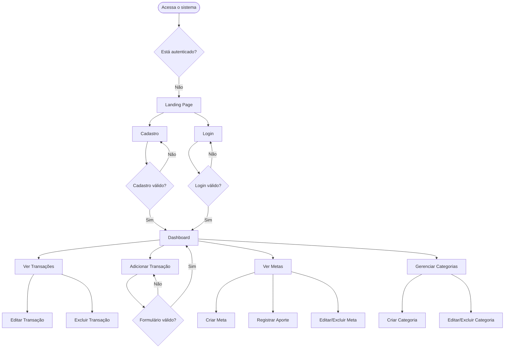
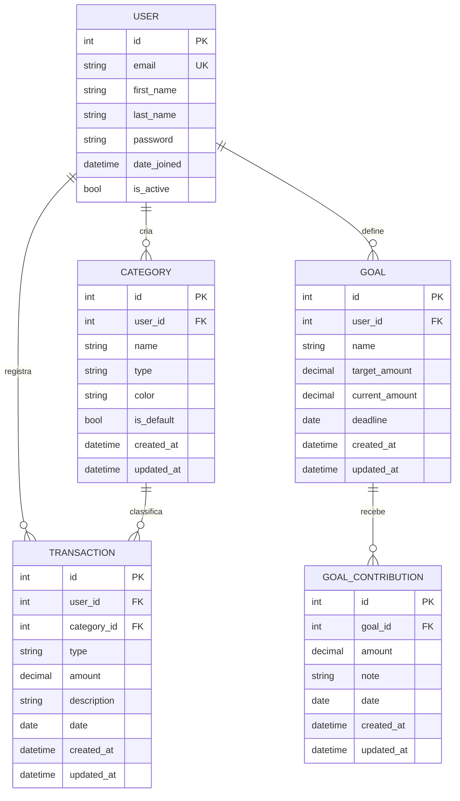

# Product Requirement Document (PRD) — Finanpy

## 1. Visão Geral

O Finanpy é um sistema web de gestão de finanças pessoais desenvolvido com Python e Django. O produto tem como missão oferecer ao usuário uma experiência simples, moderna e eficiente para controlar suas receitas, despesas e metas financeiras, tudo em um único lugar, com interface intuitiva e design agradável.

O sistema é construído com foco em simplicidade técnica e visual: sem over engineering, sem tecnologias desnecessárias. A stack é Django full stack com Django Template Language e TailwindCSS no frontend, autenticação nativa do Django com login via e-mail, e SQLite como banco de dados.

---

## 2. Sobre o Produto

**Nome:** Finanpy  
**Tipo:** Aplicação web — sistema de gestão de finanças pessoais  
**Stack principal:** Python, Django, Django Template Language, TailwindCSS  
**Banco de dados:** SQLite (padrão Django)  
**Autenticação:** Sistema nativo de usuários Django, com login por e-mail  
**Idioma da interface:** Português Brasileiro  
**Idioma do código:** Inglês  

O sistema possui uma landing page pública com opções de cadastro e login. Após autenticado, o usuário acessa o dashboard principal com visão consolidada das suas finanças.

---

## 3. Propósito

Permitir que qualquer pessoa possa registrar, acompanhar e entender sua situação financeira pessoal de forma simples, visual e organizada, sem a complexidade de ferramentas de mercado voltadas para empresas ou profissionais de finanças.

O Finanpy resolve problemas comuns como:
- Falta de controle sobre gastos mensais
- Dificuldade em visualizar o saldo real disponível
- Ausência de histórico de receitas e despesas
- Dificuldade em criar e acompanhar metas financeiras

---

## 4. Público-Alvo

- **Perfil principal:** Pessoas físicas entre 18 e 45 anos que desejam organizar suas finanças pessoais
- **Nível técnico:** Usuário comum, sem necessidade de conhecimento financeiro avançado
- **Contexto de uso:** Uso individual, em dispositivos desktop e mobile
- **Dores do usuário:**
  - Não sabe exatamente quanto gasta por mês
  - Usa planilhas dispersas ou anotações informais
  - Quer uma solução gratuita e fácil de usar
  - Quer visualizar seu progresso financeiro de forma clara

---

## 5. Objetivos

### Objetivos do Produto
1. Fornecer um sistema de registro de receitas e despesas por categoria
2. Exibir um dashboard com resumo financeiro do mês atual
3. Permitir o controle de metas financeiras pessoais
4. Oferecer histórico de transações com filtros por período e categoria
5. Ser responsivo e utilizável em qualquer dispositivo

### Objetivos de Negócio
1. Entregar um MVP funcional com baixo custo de infraestrutura (SQLite + Django simples)
2. Manter o código limpo, simples e fácil de evoluir
3. Validar o produto com usuários reais antes de adicionar complexidade

---

## 6. Requisitos Funcionais

### 6.1 Autenticação e Usuários
- RF01 — O sistema deve permitir cadastro de novos usuários com nome, e-mail e senha
- RF02 — O login deve ser feito com e-mail (não username)
- RF03 — O sistema deve permitir logout
- RF04 — O sistema deve redirecionar usuários não autenticados para a página de login
- RF05 — Após login, o usuário é redirecionado ao dashboard principal

### 6.2 Landing Page (Pública)
- RF06 — O sistema deve ter uma página inicial pública com apresentação do produto
- RF07 — A landing page deve conter botões de "Cadastre-se" e "Entrar"

### 6.3 Dashboard
- RF08 — O dashboard deve exibir o saldo atual (receitas - despesas do mês)
- RF09 — O dashboard deve exibir total de receitas do mês
- RF10 — O dashboard deve exibir total de despesas do mês
- RF11 — O dashboard deve exibir as últimas transações registradas
- RF12 — O dashboard deve exibir progresso das metas financeiras ativas

### 6.4 Transações
- RF13 — O usuário deve poder registrar uma transação informando: tipo (receita/despesa), valor, categoria, descrição e data
- RF14 — O usuário deve poder editar uma transação existente
- RF15 — O usuário deve poder excluir uma transação
- RF16 — O usuário deve poder listar todas as transações com filtros por tipo, categoria e período

### 6.5 Categorias
- RF17 — O sistema deve ter categorias padrão pré-cadastradas (ex: Alimentação, Transporte, Saúde, Lazer, Salário)
- RF18 — O usuário deve poder criar categorias personalizadas
- RF19 — O usuário deve poder editar e excluir suas categorias personalizadas

### 6.6 Metas Financeiras
- RF20 — O usuário deve poder criar metas com nome, valor alvo e prazo
- RF21 — O usuário deve poder registrar aportes parciais em uma meta
- RF22 — O sistema deve exibir o progresso de cada meta (valor atual vs. valor alvo)
- RF23 — O usuário deve poder editar e excluir metas

---

### 6.7 Fluxograma UX (Mermaid)



---

## 7. Requisitos Não-Funcionais

- RNF01 — O sistema deve ser responsivo e funcionar em dispositivos mobile e desktop
- RNF02 — O código deve seguir a PEP8 e usar aspas simples
- RNF03 — O código deve ser escrito em inglês
- RNF04 — A interface do usuário deve estar em português brasileiro
- RNF05 — Toda tabela/model deve conter os campos `created_at` e `updated_at`
- RNF06 — O banco de dados utilizado deve ser SQLite (padrão Django)
- RNF07 — O projeto deve usar Class Based Views sempre que possível
- RNF08 — Signals, quando utilizados, devem ficar em `signals.py` dentro da app correspondente
- RNF09 — Docker não será implementado no MVP (sprint final)
- RNF10 — Testes automatizados não serão implementados no MVP (sprint final)
- RNF11 — O projeto deve ser simples e enxuto — nada além do solicitado deve ser adicionado
- RNF12 — O sistema deve ter bom desempenho para uso individual com SQLite
- RNF13 — O gerenciador de pacotes e ambientes virtuais utilizado deve ser o `uv`; é proibido o uso de `pip` diretamente ou de `requirements.txt`
- RNF14 — Todos os comandos recorrentes de desenvolvimento devem ser executados via `task <nome>` (Taskipy); o uso direto de `uv run python manage.py` é permitido apenas para comandos não mapeados no Taskipy
- RNF15 — O linter do projeto é o `ruff`; a verificação de estilo deve ser feita com `task lint` antes de qualquer commit

---

## 8. Arquitetura Técnica

### 8.1 Stack

| Camada | Tecnologia |
|---|---|
| Linguagem | Python 3.12+ |
| Framework web | Django 5.x |
| Frontend | Django Template Language + TailwindCSS |
| Banco de dados | SQLite (padrão Django) |
| Autenticação | Django Auth (login via e-mail) |
| Gerenciador de pacotes e ambientes | `uv` |
| Task runner | `taskipy` |
| Linter / formatter | `ruff` |
| Arquivo de dependências | `pyproject.toml` + `uv.lock` |

### 8.2 Configuração do Taskipy — `pyproject.toml`

Após instalar as dependências de desenvolvimento (`uv add --dev taskipy ruff`), adicionar o bloco abaixo ao `pyproject.toml`:

```toml
[tool.taskipy.tasks]
startapp       = "uv run python manage.py startapp"
makemigrations = "uv run python manage.py makemigrations"
migrate        = "uv run python manage.py migrate"
createsuperuser = "uv run python manage.py createsuperuser"
runserver      = "uv run python manage.py runserver"
pytest         = "uv run pytest -vv"
shell_plus     = "uv run python manage.py shell_plus"
showmigrations = "uv run python manage.py showmigrations"
lint           = "ruff check"
lint_fix       = "ruff check --fix"
```

### 8.3 Referência de Comandos

| Ação | Comando |
|---|---|
| Inicializar projeto | `uv init finanpy` |
| Adicionar dependência de produção | `uv add django` |
| Adicionar dependências de dev | `uv add --dev taskipy ruff` |
| Sincronizar ambiente | `uv sync` |
| **Criar app Django** | `task startapp <nome>` |
| **Criar migrations** | `task makemigrations` |
| **Aplicar migrations** | `task migrate` |
| **Ver status das migrations** | `task showmigrations` |
| **Criar superusuário** | `task createsuperuser` |
| **Executar servidor de desenvolvimento** | `task runserver` |
| **Abrir shell interativo** | `task shell_plus` |
| **Executar testes** | `task pytest` |
| **Verificar linting** | `task lint` |
| **Corrigir linting automaticamente** | `task lint_fix` |
| Carregar fixtures | `uv run python manage.py loaddata <fixture>` |

> **Regra:** Qualquer comando listado no Taskipy **deve** ser chamado via `task`. Apenas `loaddata` e outros comandos pontuais não mapeados podem usar `uv run python manage.py` diretamente.

### 8.4 Estrutura de Diretórios

```
finanpy/
├── manage.py
├── pyproject.toml        ← dependências + configuração do taskipy e ruff
├── uv.lock
├── finanpy/
│   ├── settings.py
│   ├── urls.py
│   ├── wsgi.py
│   └── asgi.py
├── core/
│   ├── models.py
│   ├── views.py
│   ├── urls.py
│   └── templates/core/
│       └── landing.html
├── accounts/
│   ├── models.py
│   ├── views.py
│   ├── urls.py
│   ├── forms.py
│   ├── backends.py
│   └── templates/accounts/
│       ├── login.html
│       └── register.html
├── transactions/
│   ├── models.py
│   ├── views.py
│   ├── urls.py
│   ├── forms.py
│   └── templates/transactions/
│       ├── list.html
│       ├── form.html
│       └── detail.html
├── categories/
│   ├── models.py
│   ├── views.py
│   ├── urls.py
│   ├── forms.py
│   └── templates/categories/
│       ├── list.html
│       └── form.html
├── goals/
│   ├── models.py
│   ├── views.py
│   ├── urls.py
│   ├── forms.py
│   └── templates/goals/
│       ├── list.html
│       └── form.html
├── dashboard/
│   ├── views.py
│   ├── urls.py
│   └── templates/dashboard/
│       └── index.html
└── templates/
    ├── base.html
    └── partials/
        ├── navbar.html
        └── sidebar.html
```

### 8.5 Estrutura de Dados (Mermaid)



---

## 9. Design System

> Tudo implementado com TailwindCSS dentro do Django Template Language.

### 9.1 Paleta de Cores

| Token | Valor | Uso |
|---|---|---|
| `bg-gray-950` | #030712 | Fundo principal (body) |
| `bg-gray-900` | #111827 | Fundo de cards e containers |
| `bg-gray-800` | #1f2937 | Bordas, inputs, separadores |
| `from-violet-600 to-indigo-600` | — | Gradiente primário (botões, destaques) |
| `text-white` | #ffffff | Texto principal |
| `text-gray-400` | #9ca3af | Texto secundário / placeholder |
| `text-emerald-400` | #34d399 | Valores positivos / receitas |
| `text-red-400` | #f87171 | Valores negativos / despesas |
| `text-violet-400` | #a78bfa | Destaques / metas |

### 9.2 Tipografia

| Elemento | Classe Tailwind |
|---|---|
| Título de página | `text-2xl font-bold text-white` |
| Subtítulo / label | `text-sm font-medium text-gray-400` |
| Corpo de texto | `text-base text-gray-200` |
| Valor monetário grande | `text-3xl font-bold text-white` |
| Fonte do sistema | `font-sans` (Inter via CDN) |

### 9.3 Botões

```html
<!-- Botão primário -->
<button class="bg-gradient-to-r from-violet-600 to-indigo-600 hover:from-violet-700 hover:to-indigo-700 text-white font-semibold py-2 px-4 rounded-lg transition-all duration-200">
  Salvar
</button>

<!-- Botão secundário -->
<button class="bg-gray-800 hover:bg-gray-700 text-gray-200 font-semibold py-2 px-4 rounded-lg border border-gray-700 transition-all duration-200">
  Cancelar
</button>

<!-- Botão de perigo -->
<button class="bg-red-600 hover:bg-red-700 text-white font-semibold py-2 px-4 rounded-lg transition-all duration-200">
  Excluir
</button>
```

### 9.4 Inputs e Forms

```html
<!-- Input padrão -->
<input type="text"
  class="w-full bg-gray-800 border border-gray-700 text-white rounded-lg px-4 py-2 focus:outline-none focus:ring-2 focus:ring-violet-500 placeholder-gray-500">

<!-- Label -->
<label class="block text-sm font-medium text-gray-400 mb-1">Nome</label>

<!-- Select -->
<select class="w-full bg-gray-800 border border-gray-700 text-white rounded-lg px-4 py-2 focus:outline-none focus:ring-2 focus:ring-violet-500">
  <option>Selecione...</option>
</select>

<!-- Textarea -->
<textarea class="w-full bg-gray-800 border border-gray-700 text-white rounded-lg px-4 py-2 focus:outline-none focus:ring-2 focus:ring-violet-500 placeholder-gray-500"></textarea>
```

### 9.5 Cards

```html
<div class="bg-gray-900 border border-gray-800 rounded-xl p-6 shadow-lg">
  <!-- conteúdo do card -->
</div>
```

### 9.6 Grid / Layout

```html
<!-- Grid principal de cards do dashboard -->
<div class="grid grid-cols-1 md:grid-cols-3 gap-6">
  <!-- cards -->
</div>

<!-- Container principal -->
<div class="max-w-7xl mx-auto px-4 sm:px-6 lg:px-8">
  <!-- conteúdo -->
</div>
```

### 9.7 Navbar e Sidebar

- **Navbar:** `bg-gray-900 border-b border-gray-800` com logo à esquerda e menu de usuário à direita
- **Sidebar:** `bg-gray-900 border-r border-gray-800` com links de navegação em `text-gray-400 hover:text-white hover:bg-gray-800`

---

## 10. User Stories

### Épico 1 — Autenticação

**US01 — Cadastro de usuário**  
Como novo usuário, quero me cadastrar com nome, e-mail e senha para acessar o sistema.  
**Critérios de aceite:**
- O formulário exige nome, e-mail válido e senha com mínimo de 8 caracteres
- O sistema valida se o e-mail já está cadastrado
- Após cadastro, o usuário é redirecionado ao dashboard
- Mensagens de erro são exibidas em caso de dados inválidos

**US02 — Login com e-mail**  
Como usuário cadastrado, quero fazer login com meu e-mail e senha.  
**Critérios de aceite:**
- O campo de login aceita e-mail (não username)
- Credenciais inválidas exibem mensagem de erro
- Login bem-sucedido redireciona para o dashboard
- Usuários não autenticados são redirecionados para login

**US03 — Logout**  
Como usuário autenticado, quero fazer logout para encerrar minha sessão.  
**Critérios de aceite:**
- O logout encerra a sessão e redireciona para a landing page

---

### Épico 2 — Dashboard

**US04 — Resumo financeiro do mês**  
Como usuário, quero ver no dashboard meu saldo, receitas e despesas do mês atual.  
**Critérios de aceite:**
- O dashboard exibe: saldo do mês, total de receitas e total de despesas
- Os valores são calculados com base nas transações do mês corrente
- Receitas aparecem em verde, despesas em vermelho, saldo na cor correspondente ao sinal

**US05 — Últimas transações**  
Como usuário, quero ver no dashboard as últimas transações registradas.  
**Critérios de aceite:**
- O dashboard exibe as 5 últimas transações
- Cada item exibe: descrição, categoria, valor e data
- Existe link para ver todas as transações

---

### Épico 3 — Transações

**US06 — Registrar transação**  
Como usuário, quero registrar uma transação informando tipo, valor, categoria, descrição e data.  
**Critérios de aceite:**
- O formulário possui campos: tipo (receita/despesa), valor, categoria, descrição, data
- Campos obrigatórios: tipo, valor, categoria e data
- Transação salva corretamente e aparece na listagem

**US07 — Listar transações com filtros**  
Como usuário, quero listar minhas transações com filtros por tipo, categoria e período.  
**Critérios de aceite:**
- A listagem exibe todas as transações do usuário autenticado
- Filtros disponíveis: tipo, categoria, mês/ano
- A listagem é ordenada da mais recente para a mais antiga

**US08 — Editar transação**  
Como usuário, quero editar uma transação existente.  
**Critérios de aceite:**
- Formulário pré-preenchido com os dados da transação
- Alterações salvas corretamente

**US09 — Excluir transação**  
Como usuário, quero excluir uma transação.  
**Critérios de aceite:**
- O sistema solicita confirmação antes de excluir
- Após exclusão, o usuário é redirecionado à listagem

---

### Épico 4 — Categorias

**US10 — Visualizar categorias**  
Como usuário, quero ver todas as categorias disponíveis.  
**Critérios de aceite:**
- Exibe categorias padrão do sistema e categorias personalizadas do usuário

**US11 — Criar categoria personalizada**  
Como usuário, quero criar categorias personalizadas para classificar minhas transações.  
**Critérios de aceite:**
- Formulário com nome e tipo (receita/despesa)
- Categoria salva e disponível nos formulários de transação

**US12 — Editar e excluir categoria personalizada**  
Como usuário, quero editar ou excluir minhas categorias personalizadas.  
**Critérios de aceite:**
- Categorias padrão não podem ser excluídas
- Ao excluir categoria com transações associadas, exibir aviso

---

### Épico 5 — Metas Financeiras

**US13 — Criar meta financeira**  
Como usuário, quero criar uma meta financeira com nome, valor alvo e prazo.  
**Critérios de aceite:**
- Formulário com: nome, valor alvo, prazo (data)
- Meta criada com progresso inicial de R$ 0,00

**US14 — Registrar aporte em meta**  
Como usuário, quero registrar um aporte parcial em uma meta.  
**Critérios de aceite:**
- Formulário com valor e data do aporte
- O progresso da meta é atualizado automaticamente

**US15 — Visualizar progresso das metas**  
Como usuário, quero visualizar o progresso de cada meta.  
**Critérios de aceite:**
- Exibe barra de progresso com percentual concluído
- Exibe valor atual e valor alvo
- Exibe prazo restante

---

## 11. Métricas de Sucesso

### KPIs de Produto
| Métrica | Descrição | Meta MVP |
|---|---|---|
| Cadastros realizados | Total de usuários criados | — |
| Retenção 7 dias | % de usuários que voltam após 7 dias | > 40% |
| Transações por usuário/mês | Média de registros por usuário ativo | > 10 |
| Metas criadas | Total de metas ativas no sistema | — |

### KPIs de Usuário
| Métrica | Descrição |
|---|---|
| Tempo para registrar transação | Deve ser < 30 segundos |
| Taxa de erro em formulários | % de submissões com erro de validação |
| Páginas mais acessadas | Dashboard e listagem de transações |

### KPIs Técnicos
| Métrica | Meta |
|---|---|
| Tempo de resposta das páginas | < 500ms |
| Erros 500 em produção | 0 por semana |
| Cobertura de código (futura) | > 80% |

---

## 12. Riscos e Mitigações

| Risco | Probabilidade | Impacto | Mitigação |
|---|---|---|---|
| SQLite não suportar múltiplos usuários simultâneos | Baixa | Médio | Produto inicial é individual; migrar para PostgreSQL na evolução |
| Escopo crescer além do MVP | Alta | Alto | Documentar e congelar o escopo do MVP; novas features em sprints futuros |
| Design inconsistente entre páginas | Média | Médio | Criar `base.html` e componentes reutilizáveis desde o início |
| Autenticação por e-mail com problemas | Baixa | Alto | Usar backend customizado `ModelBackend` com campo email |
| TailwindCSS sem compilação em desenvolvimento | Média | Baixo | Usar CDN do Tailwind para desenvolvimento; compilar via CLI na produção |

---

## 13. Lista de Tarefas — Sprints

---

### Sprint 1 — Setup e Estrutura Base

#### 1.1 Configuração do Projeto
- [ ] Inicializar o projeto com `uv init finanpy` (cria `pyproject.toml` automaticamente)
- [ ] Adicionar Django (`uv add django`)
- [ ] Adicionar dependências de desenvolvimento (`uv add --dev taskipy ruff`)
- [ ] Configurar o bloco `[tool.taskipy.tasks]` no `pyproject.toml` conforme seção 8.2
- [ ] Criar o projeto Django (`uv run django-admin startproject finanpy .`)
- [ ] Configurar `settings.py`: timezone, idioma, static files, templates
- [ ] Configurar `LANGUAGE_CODE = 'pt-br'` e `TIME_ZONE = 'America/Sao_Paulo'`
- [ ] Inicializar repositório Git e criar `.gitignore` (incluir `.venv/`)
- [ ] Validar que `task runserver` sobe o servidor corretamente

#### 1.2 Configuração do TailwindCSS
- [ ] Adicionar CDN do Tailwind no `base.html` para desenvolvimento
- [ ] Criar `base.html` com estrutura HTML5, meta viewport e importação do Tailwind
- [ ] Definir fundo escuro padrão no `<body>`: `class="bg-gray-950 text-white min-h-screen"`

#### 1.3 Estrutura de Apps
- [ ] Criar app `core` (`task startapp core`)
- [ ] Criar app `accounts` (`task startapp accounts`)
- [ ] Criar app `transactions` (`task startapp transactions`)
- [ ] Criar app `categories` (`task startapp categories`)
- [ ] Criar app `goals` (`task startapp goals`)
- [ ] Criar app `dashboard` (`task startapp dashboard`)
- [ ] Registrar todas as apps em `INSTALLED_APPS`

---

### Sprint 2 — Autenticação

#### 2.1 Model de Usuário
- [ ] Criar backend customizado em `accounts/backends.py` para login via e-mail
- [ ] Registrar o backend em `settings.py`: `AUTHENTICATION_BACKENDS`
- [ ] Criar `LOGIN_URL`, `LOGIN_REDIRECT_URL` e `LOGOUT_REDIRECT_URL` no settings

#### 2.2 Formulários de Autenticação
- [ ] Criar `accounts/forms.py` com `RegisterForm` (nome, e-mail, senha)
- [ ] Criar `accounts/forms.py` com `LoginForm` (e-mail, senha)
- [ ] Validar unicidade de e-mail no `RegisterForm`

#### 2.3 Views de Autenticação
- [ ] Criar `RegisterView` (CreateView ou FormView) em `accounts/views.py`
- [ ] Criar `LoginView` customizada com autenticação por e-mail
- [ ] Criar `LogoutView` usando o logout nativo do Django
- [ ] Configurar redirecionamento pós-login para `/dashboard/`
- [ ] Configurar redirecionamento pós-logout para `/`

#### 2.4 Templates de Autenticação
- [ ] Criar `accounts/templates/accounts/login.html` com design dark e gradiente
- [ ] Criar `accounts/templates/accounts/register.html` com design dark e gradiente
- [ ] Exibir mensagens de erro de validação nos templates
- [ ] Adicionar link "Já tem conta? Entrar" no cadastro e vice-versa

#### 2.5 URLs de Autenticação
- [ ] Criar `accounts/urls.py` com rotas: `/login/`, `/logout/`, `/cadastro/`
- [ ] Incluir `accounts.urls` no `finanpy/urls.py`

---

### Sprint 3 — Landing Page

#### 3.1 App Core — Landing Page
- [ ] Criar view `LandingPageView` em `core/views.py`
- [ ] Criar template `core/templates/core/landing.html`
- [ ] Implementar seção hero com nome do produto, slogan e botões "Cadastre-se" e "Entrar"
- [ ] Implementar seção de features/benefícios do produto
- [ ] Garantir que a landing page redirecione usuários já autenticados para o dashboard
- [ ] Criar `core/urls.py` e incluir no `finanpy/urls.py`

---

### Sprint 4 — Categorias

#### 4.1 Model de Categoria
- [ ] Criar model `Category` em `categories/models.py` com campos: `user` (FK nullable), `name`, `type` (receita/despesa), `color`, `is_default`, `created_at`, `updated_at`
- [ ] Criar e aplicar migrations (`task makemigrations` e `task migrate`)
- [ ] Criar fixture com categorias padrão (Alimentação, Transporte, Saúde, Lazer, Salário, Educação, Moradia, Outros)
- [ ] Carregar fixture no banco de dados (`uv run python manage.py loaddata categories`)

#### 4.2 Views de Categoria
- [ ] Criar `CategoryListView` (ListView) — exibe categorias padrão + personalizadas do usuário
- [ ] Criar `CategoryCreateView` (CreateView) — apenas categorias do usuário
- [ ] Criar `CategoryUpdateView` (UpdateView) — apenas categorias do próprio usuário
- [ ] Criar `CategoryDeleteView` (DeleteView) — validar que não é categoria padrão
- [ ] Proteger todas as views com `LoginRequiredMixin`

#### 4.3 Formulário de Categoria
- [ ] Criar `CategoryForm` em `categories/forms.py` com campos: nome, tipo, cor

#### 4.4 Templates de Categoria
- [ ] Criar `categories/list.html` com tabela de categorias e botões de editar/excluir
- [ ] Criar `categories/form.html` para criar e editar categoria
- [ ] Adicionar confirmação de exclusão

#### 4.5 URLs de Categoria
- [ ] Criar `categories/urls.py` com rotas CRUD
- [ ] Incluir no `finanpy/urls.py`

---

### Sprint 5 — Transações

#### 5.1 Model de Transação
- [ ] Criar model `Transaction` em `transactions/models.py` com campos: `user` (FK), `category` (FK), `type` (receita/despesa), `amount` (DecimalField), `description`, `date`, `created_at`, `updated_at`
- [ ] Criar e aplicar migrations (`task makemigrations` e `task migrate`)

#### 5.2 Views de Transação
- [ ] Criar `TransactionListView` (ListView) com filtros por tipo, categoria e mês
- [ ] Criar `TransactionCreateView` (CreateView)
- [ ] Criar `TransactionUpdateView` (UpdateView)
- [ ] Criar `TransactionDeleteView` (DeleteView) com confirmação
- [ ] Proteger todas as views com `LoginRequiredMixin`
- [ ] Garantir que o usuário acessa apenas suas próprias transações (`get_queryset`)

#### 5.3 Formulário de Transação
- [ ] Criar `TransactionForm` em `transactions/forms.py`
- [ ] Popular campo `category` apenas com categorias do usuário + categorias padrão
- [ ] Campo `date` com widget de data

#### 5.4 Templates de Transação
- [ ] Criar `transactions/list.html` com tabela, filtros e totalizadores
- [ ] Criar `transactions/form.html` para criar e editar
- [ ] Exibir valor em verde (receita) ou vermelho (despesa) na listagem

#### 5.5 URLs de Transação
- [ ] Criar `transactions/urls.py` com rotas CRUD
- [ ] Incluir no `finanpy/urls.py`

---

### Sprint 6 — Dashboard

#### 6.1 View do Dashboard
- [ ] Criar `DashboardView` (TemplateView ou View) em `dashboard/views.py`
- [ ] Calcular saldo do mês atual (receitas - despesas)
- [ ] Calcular total de receitas do mês
- [ ] Calcular total de despesas do mês
- [ ] Buscar as últimas 5 transações do usuário
- [ ] Buscar metas ativas com progresso
- [ ] Proteger com `LoginRequiredMixin`

#### 6.2 Template do Dashboard
- [ ] Criar `dashboard/templates/dashboard/index.html`
- [ ] Criar cards de resumo: Saldo, Receitas, Despesas
- [ ] Criar tabela/lista de últimas transações
- [ ] Criar seção de metas com barra de progresso
- [ ] Adicionar links para criar nova transação e ver todas

---

### Sprint 7 — Metas Financeiras

#### 7.1 Models de Metas
- [ ] Criar model `Goal` em `goals/models.py` com campos: `user` (FK), `name`, `target_amount`, `current_amount`, `deadline`, `created_at`, `updated_at`
- [ ] Criar model `GoalContribution` com campos: `goal` (FK), `amount`, `note`, `date`, `created_at`, `updated_at`
- [ ] Criar e aplicar migrations (`task makemigrations` e `task migrate`)

#### 7.2 Views de Metas
- [ ] Criar `GoalListView` (ListView)
- [ ] Criar `GoalCreateView` (CreateView)
- [ ] Criar `GoalUpdateView` (UpdateView)
- [ ] Criar `GoalDeleteView` (DeleteView)
- [ ] Criar `GoalContributionCreateView` para registrar aportes
- [ ] Proteger todas com `LoginRequiredMixin`
- [ ] Atualizar `current_amount` da meta ao salvar um aporte

#### 7.3 Formulários de Metas
- [ ] Criar `GoalForm` em `goals/forms.py`
- [ ] Criar `GoalContributionForm` em `goals/forms.py`

#### 7.4 Templates de Metas
- [ ] Criar `goals/list.html` com cards de metas e barras de progresso
- [ ] Criar `goals/form.html` para criar e editar meta
- [ ] Criar modal ou página de aporte em meta

#### 7.5 URLs de Metas
- [ ] Criar `goals/urls.py` com rotas CRUD + aporte
- [ ] Incluir no `finanpy/urls.py`

---

### Sprint 8 — Navbar, Sidebar e Layout Global

#### 8.1 Componentes de Navegação
- [ ] Criar `templates/partials/navbar.html` com logo, menu e dropdown de usuário
- [ ] Criar `templates/partials/sidebar.html` com links para: Dashboard, Transações, Categorias, Metas
- [ ] Incluir os partials no `base.html` com ``
- [ ] Implementar destaque no link ativo da sidebar com `request.resolver_match.url_name`

#### 8.2 Layout Responsivo
- [ ] Garantir sidebar colapsável em mobile
- [ ] Testar responsividade em viewport 375px, 768px e 1280px
- [ ] Garantir que todos os formulários são usáveis em mobile

---

### Sprint 9 — Polimento e Entrega do MVP

#### 9.1 Mensagens de Feedback
- [ ] Configurar Django Messages Framework
- [ ] Exibir mensagens de sucesso/erro em todos os formulários via `messages`
- [ ] Criar partial `templates/partials/messages.html` e incluir no `base.html`

#### 9.2 Tratamento de Erros
- [ ] Criar página `404.html` com design do sistema
- [ ] Criar página `500.html` com design do sistema
- [ ] Configurar `handler404` e `handler500` no `urls.py`

#### 9.3 Segurança e Validações
- [ ] Garantir que `@login_required` ou `LoginRequiredMixin` está em todas as views privadas
- [ ] Garantir que queries de objetos filtram sempre pelo `user` autenticado
- [ ] Verificar CSRF em todos os formulários

#### 9.4 Revisão Final
- [ ] Revisar todos os templates para consistência visual
- [ ] Garantir que todos os campos `created_at` e `updated_at` estão presentes nos models
- [ ] Executar `task lint` e corrigir todos os avisos antes do commit final
- [ ] Verificar PEP8 em todos os arquivos Python
- [ ] Testar fluxo completo: cadastro → login → transação → meta → logout

---

*Sprints futuros (não incluídos no MVP):*
- [ ] Sprint 10 — Docker e containerização
- [ ] Sprint 11 — Testes automatizados (`uv add --dev pytest-django` + `task pytest`)
- [ ] Sprint 12 — Relatórios e gráficos financeiros
- [ ] Sprint 13 — Migração para PostgreSQL
